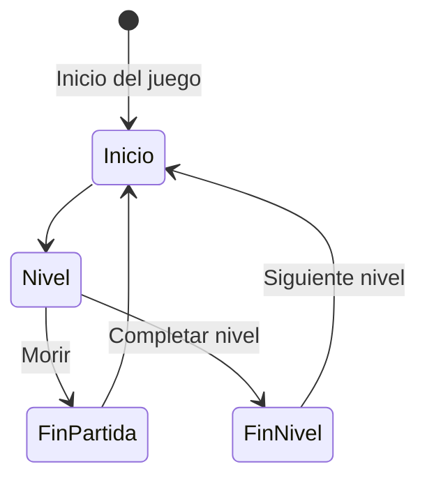

# DEV24-Gherasim
Práctica final de la asignatura Desarrollo de Videojuegos del Master en Ingeniería Informática de la Universidad Complutense de Madrid.\
MISIÓN RICARDO - An Enrique Amarillo Game
## Instalación y uso
Para probar el juego basta con descargarse el ejecutable de la sección de Releases.

Para poder abrir el proyecto en Unreal hace falta descargarse la carpeta Content e incluirla en la raíz del proyecto. Si se tiene permiso, es posible descargarla [aquí](https://drive.google.com/drive/folders/1PsP9Cur4vbDyPKDe3inxqlXQd9iHddhU?usp=drive_link).

### Controles
Los controles del juego son los siquientes:
- Movimiento: WASD.
- Saltar: Barra espaciadora.
- Cambiar de arma: Rueda del ratón.
- Movimiento de la cámara: Movimiento del ratón.
- Apuntar con la mira: mantener click derecho.
- Disparar: Click izquierdo.
- Correr: Mantener Shift izquierdo.
- Armas al máximo(Para testeo más fácil): Y.

## Preproducción
El juego será un shooter en primera persona con mecánicas rogue-like basado en la popular franquicia multimedia [Enrique Amarillo](https://www.youtube.com/@enriqueamarillo7126).

### Historia
Eres Ricardo, el mejor cadete de la academia militar del ejército anti-Enrique. Ante ti está tú último desafío para poder graduarte e ir de una vez por todas a acabar con el condenado Enrique Amarillo. Ayudándose de la última tecnología disponible en Persépolis, *El Puto Amo* ha creado un simulador de combate de última generación para que sepas cómo efrentarte a Enrique Amarillo y sus allegados cuando llegue el momento decisivo. Aguanta todo lo que puedas y demuestra que la cera es capaz de salir del oído.
### Características principales
Las características principales se dividen en cinco grandes puntos: A, B, C, D y E. El punto A adapta el proyecto que se utilizará como punto de partida para construir el juego final sobre él. El punto B y C son características que se han implementado en prácticas anteriores y se ampliarán en esta práctica final. Por último, los puntos D y E serán las características novedosas de esta práctica con respecto a las otras que se han desarrollado durante la asignatura.

A - El jugador se moverá libremente por el mapa con una vista en primera persona y podrá disparar a los enemigos haciendo uso de un arma que tendrá equipada desde el principio con el objetivo de superar el nivel.

B - Para progresar en el juego el jugador deberá ir superando los niveles sobreviviendo a las oleadas de enemigos que irán a atacarlo sin piedad. Cuando se supere un nivel comenzará otro con un mayor nivel de dificultad, se generarán más enemigos y estos aguantarán más. Cada nivel se jugará en un mapa aleatorio de entre los distintos tipos de mapa disponibles, cada uno con desafíos diferentes.

C - El jugador podrá elegir entre varias armas disponibles en su inventario. A medida que se vayan derrotando enemigos tanto las armas como el jugador irán subiendo de nivel lo que aumentará sus características. A determinados niveles las armas recibirán una mejora que potenciará sus habilidades o les dará un efecto adicional.

D - Habrá distintos tipos de enemigos con distintos tipos de ataque, tanto a melé como a distancia el daño que harán podrá ser en área o a un solo objetivo. Los propios enemigos y las armas del jugador tendrán un tipo, los enemigos serán débiles, inmmunes o resistirán determinados tipos de daño, por lo que el jugador deberá hacer uso de las distintas armas para poder sobrevivir de manera más eficaz. Los enemigos que aparezcan en cada nivel serán determinados de manera aleatoria.

E - Habrá dos modos de juego, Genocidio y Supervivencia. Al comienzo del nivel se determinará el modo de juego, en modo Genocidio el jugador deberá acabar con todos los enemigos para poder pasar al siguiente nivel mientras que en el modo Supervivencia deberá aguantar un determinado tiempo mientras los enemigos no paran de aparecer.
## Punto de partida
Como punto de partida para esta práctica se usará la plantilla **First Person** de Unreal Engine 5. Esta práctica final se basará en el estilo de juego de la práctica 3 *Invasión Androide*, un juego de disparos en primera persona.  

## Estética
Los escenarios y los enemigos del juego estarán basados en ubicaciones y personajes de la serie. El personaje principal será Ricardo y los enemigos serán los distintos Enriques de colores. Los mapas intentarán simular los distintos escenarios que aparecen en la serie en una versión 3D.

## Gráficos
Los elementos gráficos utilizados para elaborar este proyecto son los siguientes:
- Para modelar a Ricardo se ha utilizado el pack de assets de Fab [Military Mercenary Bandit](https://fab.com/s/71ab936b36b3). Las animaciones del personaje se han modificado a partir de [Animation Starter Pack](https://fab.com/s/5b8a9c9d3c77).
- El arma del jugador utiliza el modelo de Fab [HK416 Full ReWorked](https://fab.com/s/17c99beb1572) como base. Cada una de las armas usa materiales personalizados para complementar la estética propia de cada rifle. El rifle de fuego y de rayos utilizan emisores de partículas, las partículas de fuego predeterminadas de Unreal para el primero y una versión modificada de los rayos de [FX Variety Pack](https://fab.com/s/025dd2d54bc2).  
- Los Enriques enemigos utilizan el esqueleto por defecto de Unreal Engine 4. Cada enemigo ha sido personalizado en Blender para adaptarlo a su homólogo en la serie. Además de esto se les han añadido sockets para agregarles elementos estéticos o armas.
    - Enrique Amarillo: Lleva puesto un sombrero vaquero [Low Poly Cartoon Cowboy Hat Free](https://fab.com/s/88c7e8d256b6) y porta una [AK47](https://fab.com/s/88a1419eaa2c), ambos obtenidos de Fab. Para las animaciones se ha utilizado también [Animation Starter Pack](https://fab.com/s/5b8a9c9d3c77).
     
    - Enrique Rojo: Tiene una cola de demonio obtenida de [Rigmodels](https://rigmodels.com/model.php?view=Devils_Tail_3d_model__d2f6e6b712454485858e1a86e88833a1) y un tridente obtenido de Fab, [Pitchfork](https://fab.com/s/d0ec1142b46e). Para las animaciones de ataque se ha hecho uso del paquete de Fab [Mega Spear Animation Pack](https://fab.com/s/5f274ce7f773).
     
    - Enrique Verde: Lleva una granada en la mano obtenida de Fab, [Low Poly Grenade](https://fab.com/s/03ff586c76a2). Se han utilizado las animaciones de [Mega Spear Animation Pack](https://fab.com/s/5f274ce7f773) y [Animation Starter Pack](https://fab.com/s/5b8a9c9d3c77) para este enemigo.
    
- El primer mapa, Detroit, está decorado con los siguientes assets de Fab:
    - [Free Small Old House](https://fab.com/s/fdfb7ba270c2)
    - [Farm House](https://fab.com/s/9666767ec960)
    - [Old House](https://fab.com/s/8d1bc4ee2fc0)
    - [ZIL 130 (body) / Lowpoly](https://fab.com/s/59ec94fbe318)
    - [HIP HOP NUTCRACKER - van Graffiti](https://fab.com/s/f38216ede849)
    - [Pile of Wheel Tires](https://fab.com/s/55c76d730f40)
    - [Tree_test](https://fab.com/s/32c894391e53)
    - [Old garage](https://fab.com/s/82c06f18f81c)
    - [Tyres concrete heap](https://fab.com/s/708a7046e272)
    - [Old Ruisty Car Apocalyptic Vehicle](https://fab.com/s/a45cbbd8d9ce)
    - [Roadside Construction](https://fab.com/s/98f74be9bd92)
    - [Cherry tree](https://fab.com/s/3e0e8c734331)
- El segundo mapa, la Base de Enrique Verde, está decorado con lo siguientes assets de Fab:
    - [Rusted corrugated panels](https://fab.com/s/0c21bd7b541c)
    - [Roadside Construction](https://fab.com/s/98f74be9bd92)
    - [UH60A Blackhawk (West)](https://fab.com/s/098a44303280)
    - [Air Tanker IL-76 (East)](https://fab.com/s/db9633d07927)
    - [Command 9S552 (East)](https://fab.com/s/c6cd1b5cc0ab) 

    También contiene un hangar obtenido de Sketchfab [Army Hangar (Ready for Unreal Engine)](https://sketchfab.com/3d-models/army-hangar-ready-for-unreal-engine-822134d21af94033895df68af5cdbd74).
    El enemigo Enrique Verde Gigante está hecho a partir de los poliedros por defecto de Unreal Engine, haciendo uso de particulas de Niagara para los láseres de los ojos. Este enemigo lanza misiles guiados que se han hecho utilizando el paquete de Fab [Missile R77 (East)](https://fab.com/s/bf0a29dd8b2b).
    
- Tanto las caras de los Enriques como los modelos de las rmas en el menú de pausa son texturas generadas a partir de PNGs. En concreto para generar los PNGs de las armas se ha hecho uso del plugin de Unreal [ThumbnailToTextureTool](https://github.com/NanceDevDiaries/ThumbnailToTextureTool/tree/5.4).
- Para los suelos de los mapas se ha empleado la herramienta Landscape y la herramienta Foliage para crear suelos de hierba.
- Los enemigos emiten un destello rojo al ser golpeados cambiando momentáneamente su material a uno personalizado.

## Sonidos
El juego tendrá musica de fondo en los niveles. Durante cada nivel sonará aleatoriamente una de entre estas cuatro canciones de la Banda Sonora Original de [The Right Universe](https://the-architect-ea.itch.io/the-right-universe):
- [Paul Ţ & Artu - The Right Universe](https://www.youtube.com/watch?v=fUNzmtUOVjw)
- [Paul Ţ - The Wrong Universe](https://www.youtube.com/watch?v=1yKh7CcgHHg)
- [Paul Ţ - THE RIGHT UNIVERSE (VIP)](https://www.youtube.com/watch?v=sjdP5UCNH4c)
- [Paul Ţ - The Only Thing They Fear](https://soundcloud.com/paul-ghetea/the-only-thing-they-fear)

Habrá efectos de sonido que sonarán al realizar alguna de las siguientes acciones, se enlazan las fuentes de cada uno excepto de las que vienen por defecto en Unreal:
- [Disparo del arma del personaje](https://samplefocus.com/samples/hard-gunshot-shot-sound-fx)
- Disparo de Enrique Amarillo
- Explosión de la granada de Enrique Verde
- Disparo del misil de Enrique Verde Gigante
- [Sonido del reactor del misil](https://pixabay.com/sound-effects/065110-seamless-rocket-booster-roar-amp-crackle-42487/)
- Explosión del misil al impactar
El protagonista y los enemigos tienen varias líneas de diálogo empleando la misma voz de [Loquendo](https://ttsdemo.com) que en la serie original. De estas, una aleatoria sonará cuando:
- El personaje ataca
- El personaje recibe daño
- El personaje muere
- Los enemigos aparecen en el mapa
- Los enemigos mueren
- Enrique Rojo genera un clon
- Enrique Verde Gigante detecta al jugador
- Enrique Verde Gigante pierde de vista al jugador
- El jugador completa un nivel
## Dinámica 
La bucle principal del juego es matar enemigos para subir de nivel el personaje y las armas y así poder superar los niveles más fácilmente. La estructura de una partida se puede representar con el siguiente diagrama:

### Objetivo
El objetivo del juego es sobrevivir el mayor tiempo posible. Para ello el jugador debe eliminar a los enemigos de cada nivel sin perder toda su vida. Para hacer esto más fácil irán mejorando tanto sus características como las de las armas que tiene disponibles al subir de nivel.
### Castigo
Si el jugador no supera el nivel porque es derrotado por los enemigos la partida acabará y deberá empezarse otra vez desde el principio perdiendo todo el progreso acumulado.
## Contenido
El contenido del juego es el siguiente:
### Ricardo
Ricardo es el protagonista de esta aventura. Su misión es derrotar a todos los Enriques y convertirse en el soldado definitivo.
### Armas
Ricardo como buen graduado de Estudios Pacifistas por la universidad de Wisconsin es un maestro en el manejo de todo tipo de rifles.
- #### Rifle normal
El rifle por defecto de Ricardo, lo tiene desde que se lo regalaron con 12 años en Navidad. Inflige daño de tipo normal a los enemigos. Si se mejora lo suficiente, obtendrá la posibilidad hacer golpes críticos e infligir el doble del daño normal a los enemigos.
- #### Rifle de fuego
Se dice que este rifle nació por reproducción autótrofa en el lejano planeta Marte. Nadie sabe como ha llegado a manos de Ricardo pero eso ya es trabajo de los guionistas. Inflige daño de fuego por ticks a los enemigos. Si se mejora lo suficiente prenderá a los enemigos en llamas y les quitará un 2% de vida máxima por segundo mientra sdure el efecto. Mientras un enemigo esté ardiendo, si se le acerca otro lo suficiente el fuego se le propagará a este también y le causará el mismo efecto.
- #### Rifle de rayos
El puto amo fabricó este rifle entre que veía las noticias y dejaba de verlas. Después de su muerte la interacción con cierto triángulo amarillo lo dotó de poderes eléctricos. Inflige daño de rayos a los enemigos. Si se mejora lo suficiente paralizará a los enemigos durante un segundo, interrumpiendo cualquier acción que estuviesen realizando.
- #### Rifle verde claro
Tras pasar por el infierno de un pez flaco este rifle obtuvo el poder de la vergononzoia. Inflige daño de tipo *la hostia* en un área. Si se mejora lo suficiente creará una área de gravedad en la zona que impacte la bala que atraerá a los enemigos hacia ella.
### Enemigos
Los enemigos de Ricardo dentro de la simulación serán copias virtuales creadas haciendo uso de estupidez real destructiva. Estas copias replicarán 1:1 el comportamiento de los Enriques reales, entre ellos:
- #### Enrique Amarillo
*Ýpsilon* 

Enrique Amarillo ha sido catalogado como una amenaza por tu superior Frank, debes acabar con el cueste lo que cueste. Enrique Amarillo es el enemigo básico, es débil al daño de rayo y ataca a distancia valiéndose de su AK47.
- #### Enrique Rojo
*No tan rápido... Pistón*

 Esta versión de Enrique utiliza la reproducción autótrofa para generar clones ilusorios de si mismo, acaba con el antes de que te sobrepasen. Es débil al daño *la hostia*, inmune al daño de fuego y ataca cuerpo a cuerpo con su puntiagudo tridente.
- #### Enrique Verde
*Me hubiese gustado que hubiesen sido negros, pero entonces no serían mis clones* 

Este clon de Enrique Verde Supremo no dudará en ir a por tí para proteger a su líder y defender su base.Es débil al daño de fuego, resiste al daño de rayos y *la hostia* y atacará lanzando granadas desde lejos que explotan haciendo daño en área.
- #### Erique Verde Gigante
*Xbox, desachtivar alarma*

Este enemigo estático es el guardián de la base Enrique Verde. Si te detecta con su aguzada vista hará saltar las alarmas y empezará a lanzarte misiles guiados para acabar contigo. Con ocultarse detrás de algo será suficiente para que diga su famosa frase.
### Mapas
El juego tendrá varios mapas por donde el jugador podrá moverse libremente mientras acaba con los enemigos. De momento se plantean estos mapas:
- Detroit: Mapa simple al aire libre.

- Base Enrique Verde: En este mapa Enrique Tanque apoyará a los enemigos disparando misiles al jugador.

- Museo de los Enriques: Mapa compartimentado en diferentes salas donde habrá que evitar ser acorralado por los enemigos

## Producción
Debido a problemas con el espacio de Git LFS los commits no coinciden con las fechas debajo mentadas ya que este proyecto ha sido resubido a un nuevo repositorio.
| Estado  |  Tarea  |  Fecha  |  
|:-:|:--|:-:|
| ✔ | Diseño: Primer borrador | 27-12-2024|
| ✔ | Assets: Personaje del jugador y armas | 05-01-2025|
| ✔ | Mecánica: Disparo y cambio de armas | 06-01-2025|
| ✔ | Mecánica: Apuntar con la mira | 07-01-2025|
| ✔ | Assets: HUD ymenú de pausa | 07-01-2025|
| ✔ | Mecánica: Tipos de daño y daño por ticks | 07-01-2025|
| ✔ | Mecánica: Indicadores de daño | 10-01-2025|
| ✔ | Assets: Enrique Verde Gigante | 13-01-2025|
| ✔ | Mecánica: Ojos láser y misiles guiados | 14-01-2025|
| ✔ | Mecánica: Parametrización de niveles y modos de juego | 15-01-2025|
| ✔ | Asets y Mecánicas: Enrique Amarillo | 16-01-2025|
| ✔ | Assets y Mecánicas: Enrique Rojo y Verde | 18-01-2025|
| ✔ | Mecánica: Botón de armas al máximo y corrección de bugs | 22-01-2025|

Como lista de mecánicas implementadas podría expresarse así:
- [x] Disparo: El jugador puede dispara el arma equipada pulsando click izquierdo. El arma unida al personaje tiene un componente que se encarga de crear un proyectil en el socket de la punta del arma. 
Este proyectil tiene un ProjectileMovementComponent que lo hace moverse hacia delante. Al impactar con un enemigo o tras un determinado tiempo el proyectil desaparece. Los proyectiles tiene unido un emisor de partículas en la cola para poder distinguir la trayectoria que siguen con mayor facilidad.
- [x] Cambio de arma: El jugador puede cambiar de arma equipada con la rueda del ratón. En el blueprint del jugador hay un array de armas en el que se avanza y retrocede moviendo hacia arriba y abajo la rueda del ratón respectivamente, cuando se cambia el arma se destruye la actual y se une una de la nueva clase.
- [x] Correr: Mientras se mantiene pulsada la tecla Shift aumenta la velocidad de movimiento del personaje.
- [x] Enemigos inteligentes: los enemigos estarán controlados por arboles de comportamiento. Los enemigos podrán detectar la posición del jugador y se acercarán a una distancia conveniente antes de atacar al jugador.
- [x] Experiencia del jugador: El jugador obtiene experiencia 10 de experiencia cada vez que mata a un enemigo. Para subir de nivel hace falta obtener **25 * (Nivel del jugador - 1) + 10** puntos de experiencia. Por cada nivel adicional el jugador obtiene 5 de vida máxima y un punto de daño adicional.
- [x] Experiencia de las armas: Al matar enemigos con un arma determinada esta obtiene experiencia. Por cada enemigo eliminado se obtiene un punto y al alcanzar 10/20/30/40/50 puntos se sube de nivel y se reinciia la experiencia acumulada. Por cada nivel el arma ganará daño y al llegar a ciertos niveles se desbloqueará la mejora del arma. Esta información está almacenada en el DataTable *WeaponProgressionTable*.
- [x] Daño elemental: Las balas del personaje inflingen un cierto tipo de daño elemental cada una. Estos tipos de daño son:
    - Normal: Tipo de daño  inflingido por el Rifle. Ningún enemigo es débil a él o lo resiste.
    - Fuego: Tipo de daño inflingido por el Rifle de Fuego. Los enemigos Enrique Verde son débiles a él y los enemigos Enrique Rojo son inmunes.
    - Rayo: Tipo de daño inflingido por el Rifle de Rayos. Los enemigos Enrique Verde lo resisten y los enemigos Enrique Amarillo son débiles a él.
    - *La hostia*: Tipo de daño inflingido por el Rifle Verde Claro. Los enemigos Enrique Rojo son débiles a él y los enemigos Enrique Verde lo resisten.
- [x] Daño por ticks: En vez de inflingir todo el daño cuando impacta la bala, este tipo de daño inflingido por las balas del Rifle de Fuego inflingen daño cada cierto tiempo durante una duración predeterminada. Para compensar el tiempo que se tarda en inflingir, aunque los ticks individuales hagna menos daño que otros disparos al final el daño acumulado es mayor.
- [x] Daño crítico: Al mejorar el Rifle a nivel 3 se desbloquea el daño crítico en este arma. 1 de cada 10 disparos será crítico e inflingirá el doble de daño que un disparo normal.
- [x] Incendiar enemigos: Al mejorar el Rifle de Fuego a nivel 4 este obtiene la habilidad de prender fuego a los enemigos durante cierto tiempo. Mientras esten ardiendo recibirán daño adicional equivalente al 2% de su vida máxima cada segundo. Si un enemigo ardiente entra en contacto con otro que no lo está, este último pasar a arder y sufrirá los mismos efectos.
- [x] Aturdir: Al mejorar el Rifle de Rayos a nivel 3 este ganrá la habilidad de aturdir a los enemigos. Los enemigos aturdidos verán interrumpido su árbol de comportamiento durante 1 segundo.
- [x] Misiles teledirigidos: Enrique Verde Gigante lanza misiles teledirigidos cada cierto tiempo mientras el jugador esté en su campo de visión. Estos misiles son proyectiles especiales que actualizan la posición del jugador y virán hacia este cada tick.
- [x] Modos de juego: Se hna implementado dos modos de juego: Genocidio y Supervivencia. En Genocidio hay que amtar a todos los enemigos para avanzar y en Supervivencia hay que sobrevivir 100 segundos.
- [x] Niveles aleatorios: Cada vez que se completa un nivel el mapa y modo de juego del próximo se escogen de manera aleatoria en GameInstance antes de abrirlo.
- [x] Dificultad incremental: Cada vez que se supera un nivel el contador de dificultad se incrementa. En función de este número la vida de los enemigos aumenta y el número de enemigos generados es mayor.
- [x] Indicadores de daño: Al inflingir daño a un enemigo este emitirá un destello rojo y la cantidad de daño que ha recibido aparecerá en blanco encima de su cabeza durante unos instantes antes de desvanecerse. El color del texto de daño variará en función de si se ha resistido o se es inmune, amarillo, si se es débil, rojo, o si ha sido un golpe crítico, aparece una imagen de fondo.
- [x] Persistencia: La experiencia conseguida por el jugador y las armas se mantienen de un nivel a otro ya que están gestionadas dentro de GameInstance.
- [x] Reinicio del juego: Al perder la partida se comienza el juego desde el principio perdiendo todo el progreso acumulado y reseteando las variables de GameInstance.
- [x] Menú de pausa: Al pulsar la P el juego se detendrá y se abrirá la interfaz de pausa donde se puede ver el inventario de las armas con su información, continuar el juego o salir.
- [x] Botón de testeo: Si se pulsa la tecla Y se suben automáticamente todas las armas a nivel 5 para que sea más fácil probar las mejroas.

Las clases principales que se han desarrollados son las siguientes:

```mermaid
classDiagram
Character <|-- Player
Character <|-- Enemy
Character <|-- EnriqueVerdeGigante
Enemy <|-- Enrique
Enrique <|-- EnriqueAmarillo
Enrique <|-- EnriqueRojo
Enrique <|-- EnriqueVerde
AIController <|-- EnemyController
AIController <|-- TurretEnemyController
Actor <|-- Spline
Actor <|-- Hangar
Actor <|-- EnemySpawner
Actor <|-- EnemyMissile
Actor <|-- Weapon
Weapon <|-- AK47
Weapon <|-- Tridente
Weapon <|-- Rifle
Weapon <|-- RifleFuego
Weapon <|-- RifleRayos
Weapon <|-- RifleVerdeClaro
Actor <|-- Projectile
Projectile <|-- AKBullet
Projectile <|-- Grenade
Projectile <|-- RifleBullet
Component <|-- HealthComponent
Component <|-- WeaponComponent
Component <|-- HitFlash
Blackboard <|-- EnemyBlackboard
BehaviorTree <|-- EnriqueAmarilloBehavior
BehaviorTree <|-- EnriqueRojoBehavior
BehaviorTree <|-- EnriqueVerdeBehavior
BehaviorTree <|-- EnriqueVerdeGiganteBehavior
BehaviorTreeTask <|-- Attack
BehaviorTreeTask <|-- ChasePlayer
BehaviorTreeTask <|-- EnableCloning
BehaviorTreeTask <|-- Reload
BehaviorTreeTask <|-- ShootMissile
AnimatioBlueprint <|-- PlayerRifle
Widget <|-- HUD 
Widget <|-- DamageText
Widget <|-- PauseMenu
GameMode <|-- MyGameMode 
GameInstance <|-- MyGameInstance
PlayerController <|-- MyPlayerController
```

## Posproducción
La posproducción ha consistido en la creación del ejecutable del juego, disponible en la sección **Releases** junto con la grabación de un [vídeo](https://drive.google.com/file/d/1W7hPSG4adcoUaySSbvb_U-e0F2HpX9kY/view?usp=sharing) de demostración en el que se puede ver como jugar al juego.

## Licencia
Iulius Gherasim, autor de la documentación, código y recursos de este juego, concedo permiso permanente a los profesores de la Facultad de Informática de la Universidad Complutense de Madrid para utilizar nuestro material, con sus comentarios y evaluaciones, con fines educativos o de investigación; ya sea para obtener datos agregados de forma anónima como para utilizarlo total o parcialmente reconociendo expresamente nuestra autoría.

Una vez superada con éxito la asignatura se prevee publicar todo en abierto (la documentación con licencia Creative Commons Attribution 4.0 International (CC BY 4.0) y el código con licencia GNU Lesser General Public License 3.0).

## Referencias
Las principales referencias del juego son:
- [Enrique Amarillo](https://www.youtube.com/@enriqueamarillo7126/featured), Ypsilon Studios, 2018. El juego se basa en los personajes, ubicaciones, estética y música de la serie.
- [Doom](https://es.wikipedia.org/wiki/Doom_(franquicia)), ID Software, 1993, para las mecánicas de shooter en primera persona.
- [Rogue](https://en.wikipedia.org/wiki/Rogue_(video_game)), A.I. Design, 1980, para las mecánicas rogue-like de quie cada partida es diferente.
- [Vampire Survivors](https://poncle.itch.io/vampire-survivors), Poncle, 2021, para las mecánicas de efrentarse a gran cantidad de enemigos para derrotarlos y subir de nivel.
- [Call of Duty: Black Ops - Zombies](https://es.wikipedia.org/wiki/Call_of_Duty:_Black_Ops#Modo_Zombies), Treyarch, 2010, para las mecánicas de sobrevivir a oleadas de enemigos matándolos a disparos.

Para la programación se han consultado las siguientes referencias:
- [How to Make a Simple Damage Indicator in Unreal Engine 5](https://www.youtube.com/watch?v=6-OQiKK6W1I)
- [Unreal Engine - Projectile Trails In 4 Minutes (Tutorial)](https://www.youtube.com/watch?v=40Ex8_O9Ab8&t=23s)
- [Unreal5 Niagra VFX: Ribbon Trails (60 SECONDS-!!)](https://www.youtube.com/watch?v=lXPSNIak64Y)
- [How to Play Background Music in a Loop in Unreal Engine 5](https://www.youtube.com/watch?v=1JelVc00qFQ)
- [UE5 Texture Repetition and Tiling quick fix](https://www.youtube.com/watch?v=ZuIdxubix8I)
- [How To Add Collision To Spline Meshes Part 2](https://www.youtube.com/watch?v=GD9KZAvAufs)
- [How To Create A Homing Projectile - Unreal Engine Tutorial](https://www.youtube.com/watch?v=tNQjoyLxKkA&t=127s)
- [Ue5 C++ Tutorial - Attach AI Perception to Head Bone](https://www.youtube.com/watch?v=rDXGeXK-PNI)
- [Unreal Multiplayer FPS #26 - Niagara Laser Beam](https://www.youtube.com/watch?v=gzVlT1vS88o&t=844s)
- [How To Make Something Always Face The Player In Unreal Engine 5 (Tutorial)](https://www.youtube.com/watch?v=FvOSdkhQ6ag&t=282s)
- [Unreal Engine 5 Projectile Tutorial: Homing Rockets](https://www.youtube.com/watch?v=2UFDWV-2wow&t=16s)
- [Unreal Engine 5: How To Add Multiple Materials to a Single Model - Adding Material Elements in UE5](https://www.youtube.com/watch?v=Wx1BzUdpEcY&t=216s)
- [#Updated #Fix for #UnrealEngine to #Blender Rig Bones Orientation #2024 #UESkeleton #Rigging](https://www.youtube.com/watch?v=aw3fjQxb0UY&t=509s)
- [How to export character and Skeletal Mesh from Unreal to Blender #Texture #Export #UE #blender](https://youtu.be/pMPeFTevPYI?si=_G0esi2d8f-e5ouZ)
- [How to export & import Skeletal Mesh between Blender and Unreal](https://youtu.be/yEGAZToNSnk?si=fNnaj9dxaW54tGY_)
- [How To Make A Countdown Timer | Unreal Engine 5 Tutorial](https://youtu.be/s6DF1fkwTE8?si=22uympt5WAIBIUpk)